# FieldMate

FieldMate guides smart phone owners through a ChatGPT-assisted capture flow for timely site information that existing APIs, smart meters, and Google Maps do not reliably capture.

FieldMate sells safe, useful submissions to roof solar panel companies, EV installers, electricity sellers, field technicians, and government teams. Participants can earn energy credits for approved submissions.

## Capture Flow

```mermaid
flowchart TD
    Start([Start FieldMate capture])
    Intro["Explain the job: 3 sections, roughly 10 minutes per section. At the end FieldMate calculates the value of energy credits and lets the participant redeem right away."]
    Demographics{"Browser has saved contact details?"}
    Autofill["Use saved browser details for name, phone, address, and email."]
    SkipDemographics["Do not force manual demographic entry."]

    MeterBrief["Section 1: Meter Box. Stand at the front of the house, record a video walking to the power meter, then hold the camera still in front of it. Show existing power meter examples."]
    MeterCapture["Participant records meter box video."]
    MeterThanks["Great, thanks. Move to the next step."]

    RoofBrief["Section 2: Roof Setup. Stand in front of the house and take a ground-level roof photo. Do not climb onto the roof."]
    RoofPhoto["Participant takes roof photo."]
    RoofPhotoCheck{"Is the roof photo clear?"}
    BlurryPhoto["Your picture was too blurry. Take the photo again holding it still."]
    OutlineBrief["Draw around the roof edge with your finger. Show a completed outline example."]
    RoofOutline["Participant outlines the roof edge."]
    OutlineCheck{"Is the roof outline complete?"}
    IncompleteOutline["You didn't complete the outline. Try to draw a complete shape around the edges of the roof with your finger, like this."]
    RoofSides["Repeat the roof photo and outline flow for the other 3 sides of the roof."]
    RoofDone["Success. Next section."]

    PoleBrief["Section 3: Power Pole. Take photos of the power pole from 2 safe angles."]
    PoleCapture["Participant captures 2 power pole angles from a safe distance."]
    PoleNotes["Capture useful notes: trees, sagging lines, storm changes, obstructions, and access constraints."]

    Rewards["Calculate rewards."]
    Wheel["Show spinning reward wheel."]
    Amount["Reveal $82 AUD in energy credits."]
    Redeem["Click here to redeem."]
    FollowUp["We will reach out when we need another data sample for another reward, likely at 6 months or after a natural disaster, hopefully just 6 months."]
    End([Submission complete])

    Start --> Intro --> Demographics
    Demographics -- Yes --> Autofill --> MeterBrief
    Demographics -- No --> SkipDemographics --> MeterBrief
    MeterBrief --> MeterCapture --> MeterThanks --> RoofBrief
    RoofBrief --> RoofPhoto --> RoofPhotoCheck
    RoofPhotoCheck -- No --> BlurryPhoto --> RoofPhoto
    RoofPhotoCheck -- Yes --> OutlineBrief --> RoofOutline --> OutlineCheck
    OutlineCheck -- No --> IncompleteOutline --> RoofOutline
    OutlineCheck -- Yes --> RoofSides --> RoofDone --> PoleBrief
    PoleBrief --> PoleCapture --> PoleNotes --> Rewards --> Wheel --> Amount --> Redeem --> FollowUp --> End
```

## Example Sections

- **Meter Box:** Capture exterior photos or video of the meter box location, including access points, obstructions, and visible conditions for field crews.
- **Roof Setup:** Capture ground-level photos of the roof and solar setup, including visible panels, shading issues, and readiness for electrification or battery installation.
- **Power Pole:** Document the service connection and power pole from a safe distance, including nearby trees, sagging lines, storm-related changes, and access constraints.

## Copied CDN Downloads

These files were copied from `https://fieldmate-mcp-app.b-cdn.net/` into `downloads/`:

- `fieldmate-mcp-app.tar.gz`
- `mcp-app.html`
- `mcp-app.html.gz`
- `screenshots/01-demographics.png`
- `screenshots/02-intro.png`
- `screenshots/03-meter-section1.png`
- `screenshots/04-roof-blur-error.png`
- `screenshots/05-roof-outline-error.png`
- `screenshots/06-calculating.png`
- `screenshots/07-reward-82-redeem.png`
