# FieldMate

FieldMate is a ChatGPT-guided capture workflow that pays households energy credits for safe, useful site data that APIs, smart meters, and satellite imagery do not reliably capture.

Instead of sending a truck roll just to learn where a meter box is, whether a roof photo is usable, or how a service pole is obstructed, FieldMate turns a smartphone owner into a guided field observer. The participant completes three short capture sections, receives an immediate reward estimate, and creates a structured data sample that can help solar installers, EV charger installers, retailers, field technicians, networks, and government resilience teams plan work faster.

## Try The Demo

[**TRY THE DEMO**](https://fieldmate-mcp-app.b-cdn.net/mcp-app.html)

*FieldMate mockup, integrated into Amber Electric*

## Prototype Preview

<table>
  <tr>
    <td>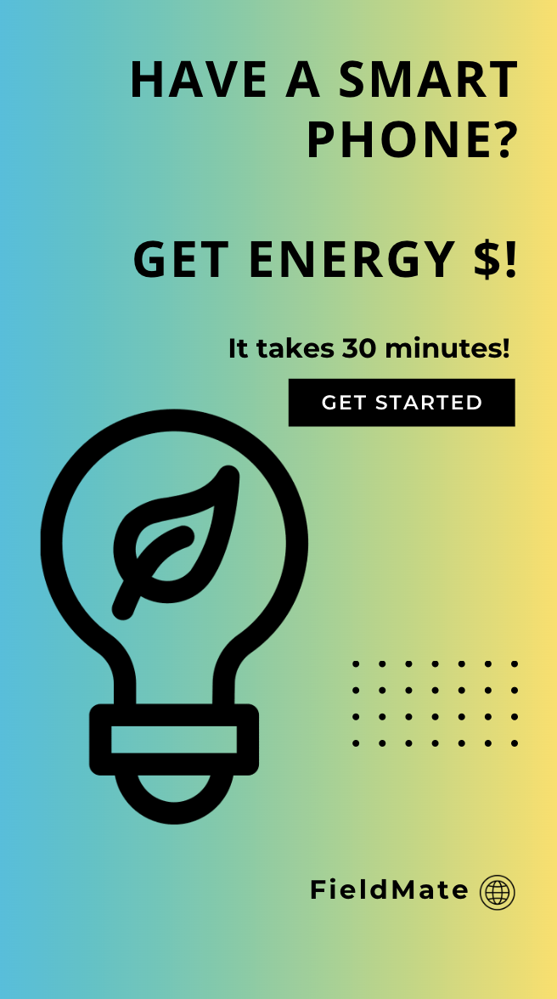</td>
    <td>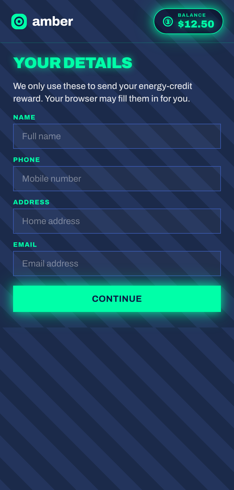</td>
    <td>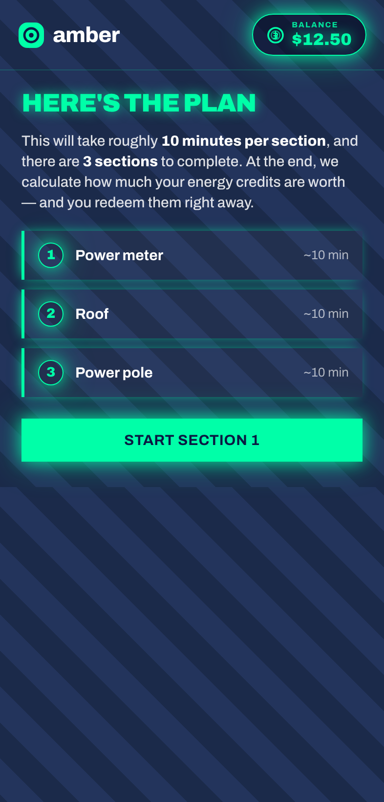</td>
    <td>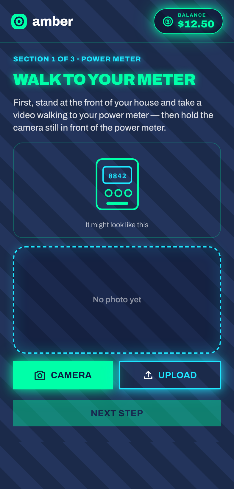</td>
  </tr>
  <tr>
    <td>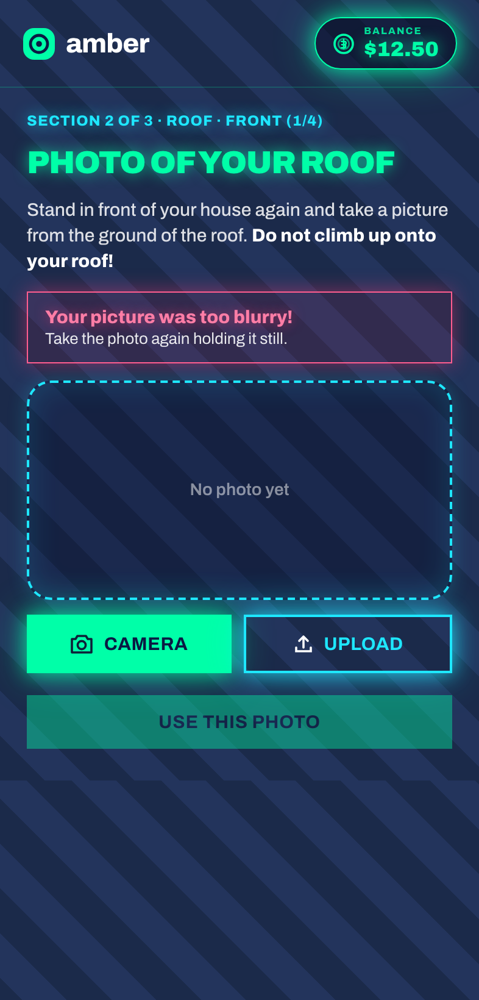</td>
    <td>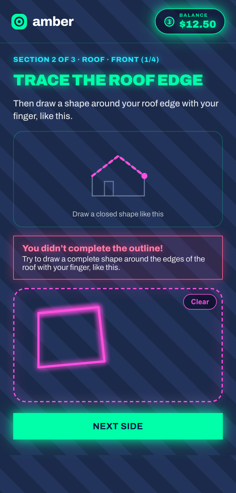</td>
    <td></td>
    <td></td>
  </tr>
</table>

## The Problem

The energy transition depends on local, physical details that are still missing from digital systems:

- Smart meters know usage, not whether the meter box is accessible, damaged, blocked, or safe to inspect.
- Google Maps and aerial imagery miss recent roof changes, shading, access constraints, storm damage, and meter/pole conditions.
- Installers and network teams often discover basic site constraints only after scheduling a visit.
- Households are asked to participate in electrification, but rarely get paid for the useful data they can safely provide.

FieldMate closes that gap with guided, validated, participant-owned capture.

## Solution

FieldMate asks for a small set of high-value observations:

- **Meter Box:** Exterior video or photos of the meter box location, access path, obstructions, and visible condition.
- **Roof Setup:** Ground-level roof photos and roof-edge outlines to support solar, battery, insulation, and electrification planning.
- **Power Pole:** Two safe-distance pole angles with notes about trees, sagging lines, storm changes, or access constraints.

The workflow is designed for normal phone users. It uses browser autofill when available, avoids forced manual demographic entry, gives concrete examples, validates blurry or incomplete roof submissions, and warns users not to climb onto roofs or approach unsafe infrastructure.

## Why It Wins

| Category | FieldMate case |
| --- | --- |
| **Innovation** | Converts household smartphone capture into structured energy-transition data that existing API, meter, and map sources miss. The reward loop turns data collection from an unpaid burden into a household incentive. |
| **Usefulness** | Serves both sides of the market: households earn energy credits, while installers, networks, retailers, field technicians, and government teams get timely site intelligence before dispatch. |
| **Viability** | Uses phones, browser autofill, single-file MCP app delivery, and reusable validation flows. It can scale suburb-by-suburb without deploying new hardware. |
| **Technical Feasibility** | The repo includes a working MCP app artifact, React capture UI, screenshots, and a server flow that can be run over Streamable HTTP or stdio. Future work can add computer-vision scoring, address verification, and buyer APIs. |
| **Business Readiness** | Clear value proposition: pay households a small reward for data that can reduce failed visits, shorten quoting cycles, improve storm response, and enrich electrification planning. |
| **Sustainability** | Better pre-site data can reduce unnecessary truck rolls, accelerate solar and EV readiness, and improve infrastructure resilience after extreme weather. |

## Business Model

FieldMate can sell verified capture packages to:

- Solar panel and battery companies assessing roof readiness.
- EV charger installers checking meter and service conditions.
- Electricity retailers targeting electrification offers.
- Distribution networks triaging pole, wire, vegetation, and storm-related risk.
- Government teams mapping resilience gaps after heatwaves, floods, fires, or storms.

Participants receive energy credits for approved submissions. Buyers pay for the data because it can reduce wasted visits, improve quote accuracy, and speed up deployment decisions.

## Pitch to Companies

FieldMate turns resident-submitted captures into actionable insight reports that buyers can use immediately. The raw photos, videos, outlines, and notes become scored lead lists, field-review queues, and location-specific datasets that can be sold to solar companies, distribution networks, EV installers, retailers, and government teams.

<table>
  <tr>
    <td>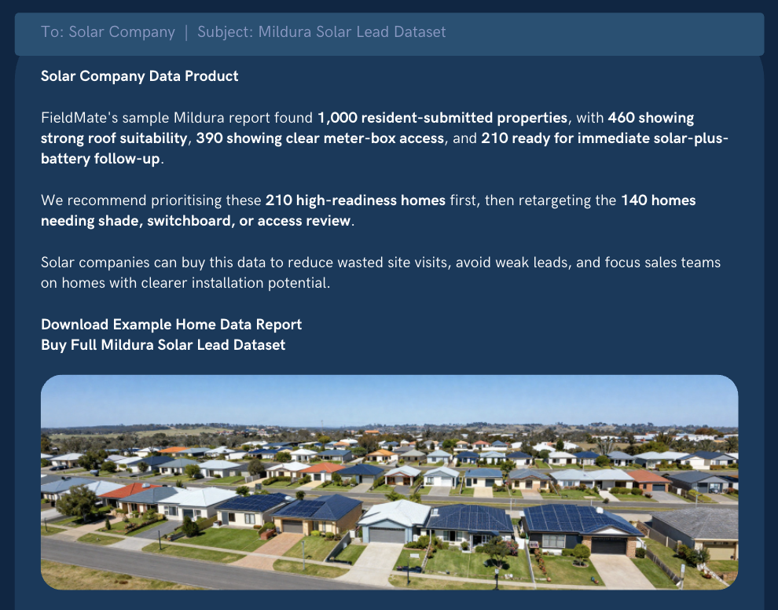</td>
    <td>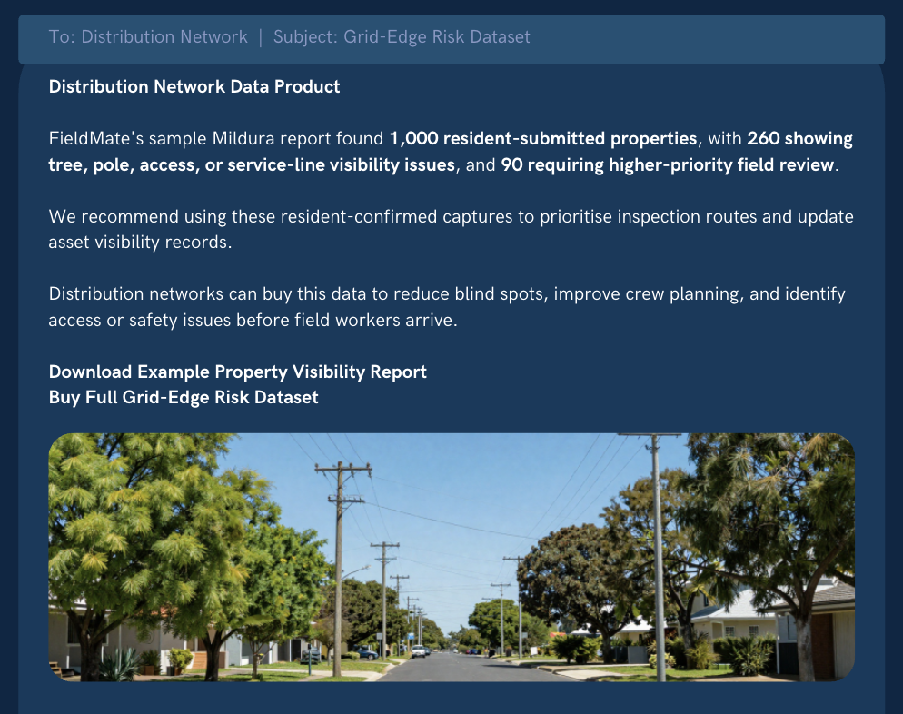</td>
  </tr>
</table>

```text
Solar Company Data Product

FieldMate's sample Mildura report found 1,000 resident-submitted properties,
with 460 showing strong roof suitability, 390 showing clear meter-box access,
and 210 ready for immediate solar-plus-battery follow-up.

We recommend prioritising these 210 high-readiness homes first, then
retargeting the 140 homes needing shade, switchboard, or access review.

Solar companies can buy this data to reduce wasted site visits, avoid weak
leads, and focus sales teams on homes with clearer installation potential.

Download Example Home Data Report
Buy Full Mildura Solar Lead Dataset
```

```text
Distribution Network Data Product

FieldMate's sample Mildura report found 1,000 resident-submitted properties,
with 260 showing tree, pole, access, or service-line visibility issues, and
90 requiring higher-priority field review.

We recommend using these resident-confirmed captures to prioritise inspection
routes and update asset visibility records.

Distribution networks can buy this data to reduce blind spots, improve crew
planning, and identify access or safety issues before field workers arrive.

Download Example Property Visibility Report
Buy Full Grid-Edge Risk Dataset
```

## Technical Architecture

The copied artifact contains a React MCP app packaged as a single HTML resource. The MCP server registers a tool with linked UI metadata, then serves the FieldMate capture UI to the host. The current prototype demonstrates the interaction model; future production work would replace the demo `get-time` tool with capture submission, validation, buyer export, and reward redemption tools.

Prototype artifacts are organized in [`MCP-Server-and-Assets/`](MCP-Server-and-Assets/):

- [`server-source/`](MCP-Server-and-Assets/server-source/) contains the compressed MCP server and React source bundle.
- [`single-file-app/`](MCP-Server-and-Assets/single-file-app/) contains the renderable `mcp-app.html` resource.
- [`mockup-examples/`](MCP-Server-and-Assets/mockup-examples/) contains the Instagram acquisition ad.
- [`pitch-assets/`](MCP-Server-and-Assets/pitch-assets/) contains presentation assets for explaining the data gap.
- [`screenshots/`](MCP-Server-and-Assets/screenshots/) contains the seven-step participant flow screenshots.

## Capture Flow


## Close Data Gaps

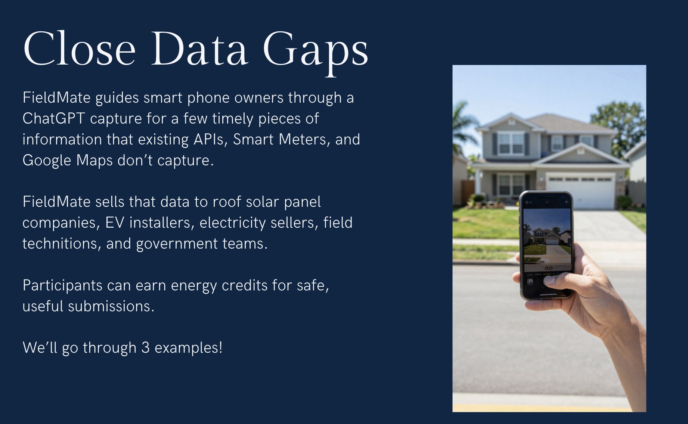

## MCP Server Flow

This is the MCP app/server structure copied into `MCP-Server-and-Assets/server-source/fieldmate-mcp-app.tar.gz`. The bundled server is based on the `@modelcontextprotocol/server-basic-react` example and serves the FieldMate React capture UI as a single MCP app resource.

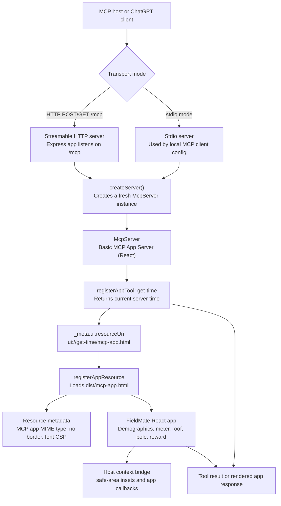

## Roadmap

- Replace demo `get-time` tool with `submit-capture`, `validate-capture`, `calculate-reward`, and `redeem-credit`.
- Add computer-vision checks for blur, roof outline completeness, meter visibility, and unsafe pole proximity.
- Add address-level consent, expiry, and buyer-specific data packages.
- Add network and installer dashboards for filtering verified submissions by geography, asset type, urgency, and recency.
- Add disaster-response campaigns that request new samples only where conditions have changed.

## MCP Server and Assets

These files were copied from `https://fieldmate-mcp-app.b-cdn.net/` into [`MCP-Server-and-Assets/`](MCP-Server-and-Assets/) and organized by purpose:

- `server-source/fieldmate-mcp-app.tar.gz`
- `single-file-app/mcp-app.html`
- `single-file-app/mcp-app.html.gz`
- `mockup-examples/00-instagram-ad.png`
- `pitch-assets/close-data-gaps.png`
- `pitch-assets/solar-company-report.png`
- `pitch-assets/distribution-network-report.png`
- `screenshots/01-demographics.png`
- `screenshots/02-intro.png`
- `screenshots/03-meter-section1.png`
- `screenshots/04-roof-blur-error.png`
- `screenshots/05-roof-outline-error.png`
- `screenshots/06-calculating.png`
- `screenshots/07-reward-82-redeem.png`

## Team

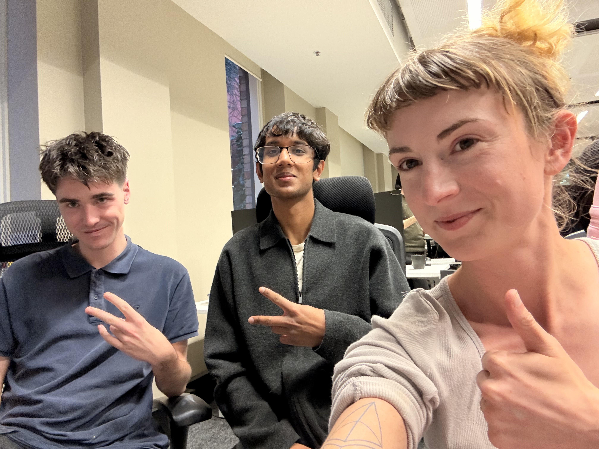

**Team FieldMate:** Jasper Fyfv, Ishaan Kataria, and Kasey Robinson.
